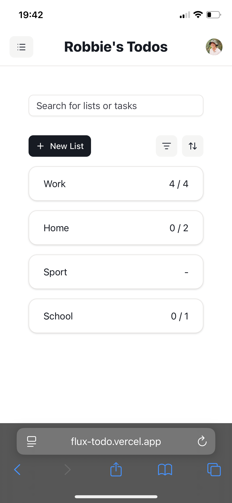

# Todo App

This application is deployed at https://flux-todo.vercel.app/.

It was built using [Next.js](https://nextjs.org/), [Prisma](https://www.prisma.io/), [Clerk](https://clerk.com/), and [TailwindCSS](https://tailwindcss.com/). I also used [Shadcn](https://ui.shadcn.com/) components, and [ngrok](https://ngrok.com/) to make a webhook that triggers a new <code>User</code> object to be added to the Prisma database when a new Clerk user is created on sign up.

### Features

The app allows a user to sign in / up, create lists, and add todo tasks to those lists. The user can also update, edit and delete those lists and tasks as per the requirements.

Lists and tasks can be filtered to those that are "complete" or "incomplete", or left unfiltered.

Lists and tasks can be sorted by either the time they were created at, or their title, in either ascending or descending order.

On the lists page there is a search bar where a user can search for lists <b>or</b> tasks. If a list title contains the search term, that list will be displayed. And if a list has a task with a description that contains the search term, that list will also be displayed, along with some muted text showing the matching task (see below).

The UI has been designed to work in either desktop or mobile browsers (see mobile view below).

# Challenges and Solutions

Initially I was using an API for my CRUD operations. However, for this to work I needed to reload the page after every update to see the change reflected in the UI. So instead, I used [server actions](https://nextjs.org/docs/app/getting-started/updating-data), which can be found in app/actions.ts. These functions update the database and then revalidates the cache on the page where the request was made, substituting in the new data without a page reload.

While this was an improvement, there was still a delay between a user action (e.g. clicking "Save" to create a new task) and the change being reflected in the UI (i.e. the task appearing in the list of tasks). This is because the UI could only reflect the change once the server action had completed and returned the updated data. This delay was short, maybe half a second, but long enough to make for a lesser user experience. I was able to make the pages much more responsive through the use of React's [useOptimistic](https://react.dev/reference/react/useOptimistic) hook. This hook allows us to immediately load in the data we expect temporarily before the server returns the actual data, making the update appear instant.

Substituting in the expected data before the server returns the actual data can introduce bugs. For example, say a user creates a new list. We optimistically show the list we expect in the UI, and this list has a temporary ID (e.g. "temp-id-1"). If the user quickly clicks on that list before the list with the actual ID (e.g. 34) is substituted, the application will navigate to "/temp-id-1" rather than "/34". This will cause an error, because there is no list with ID "temp-id-1" in the database. I prevented bugs of this nature by disabling the UI components of lists / tasks with optimistic data (using a "pending" flag on the object) until the actual data had been loaded.

# Areas for improvement

I could use fuzzy matching in the search for a more forgiving / flexible search.

There is a small bug where if you open the "Edit Task" dialog, and then click off it without saving, the click propagates to the card component and updates the task as complete / incomplete.

I could extract my own DialogButton and DropdownMenu components to reduce code duplication.

The page loads between the lists page ("/") and the list / tasks page ("/[id]") takes longer than I'd like. It seems like part of this is the time it takes for Clerk to fetch the current user, but it is something I'd like to look into further.
